## [PASO 1] Añadir las dependencias :

#### [DEPENDENCIAS CON MAVEN]
```xml
<dependency>
    <groupId>org.hibernate</groupId>
    <artifactId>hibernate-core</artifactId>
    <version>5.4.10.Final</version>
</dependency>
```

## [ DEPENDENCIAS CON LIBRERIAS] librerias
#### Añadir Librerias Netbeans
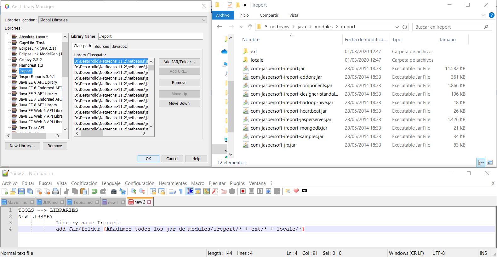
#### Añadir Librerias Proyecto
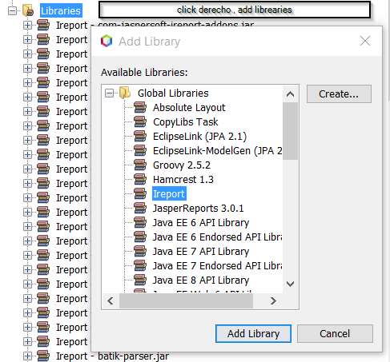

## [PASO 2] Crear un informe 
| Accion | Descipcion|
| ------ | ------ |
|descargar e instalar  IREPORTS |[iReport-5.6.0-windows-installer.exe] (https://netcologne.dl.sourceforge.net/project/ireport/iReport/iReport-5.6.0/iReport-5.6.0-windows-installer.exe) |
|Generar un informe | archivo : new : selecionar plantilla : seleccionar ruta de guardado |
|Seleccionar DB de prueba||
|SQL del informe||
|Paleta Herramientas|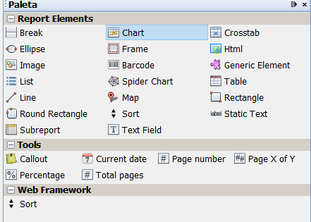|
|Panel del Informe|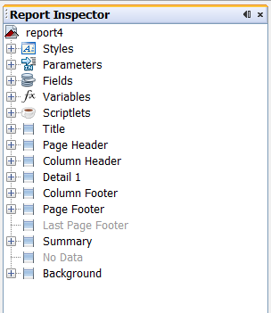|
|Compilar Informe|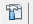|
|compilados .jasper |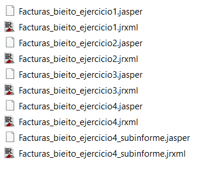|
|add group |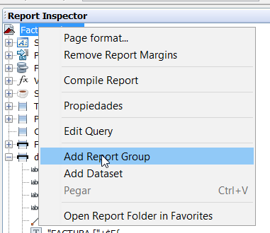|
|add parameter |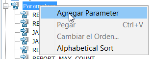|
|ej. parameter |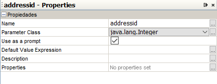|
|add grafico||
|add subinforme|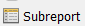|

## [PASO 3] Uso en un proyecto

*  CONEXION BASE DE DATOS   *
```java
public class Factura{
[..]
        public static Connection conexion = null;
        String baseDatos = "jdbc:hsqldb:hsql://localhost";
        String usuario = "sa";
        String clave = "";

   //Constructor que conecta a la base de datos de prueba
    public Factura()
    {
        try{
            Class.forName("org.hsqldb.jdbcDriver").newInstance();
            conexion = DriverManager.getConnection(baseDatos,usuario,clave);
        }

        catch (ClassNotFoundException cnfe){
            System.err.println("Fallo al cargar JDBC");
            System.exit(1);
        }

        catch (SQLException sqle){
            System.err.println("No se pudo conectar a BD");
            System.exit(1);
        }

        catch (java.lang.InstantiationException sqlex){
            System.err.println("Imposible Conectar");
            System.exit(1);
        }

        catch (Exception ex){
            System.err.println("Imposible Conectar");
            System.exit(1);
        }

    }

```
*  INTERACTUAR CON EL INFORME   *
       
```java
public class Factura{
        static final String  fileInforme = "."+File.separator+"informe"+File.separator+"Facturas_bieito_ejercicio2.jasper";
        static final int []addressid = {0,4,5,8,9,13,15,19,20,21,22,23,24,26,27,29,30,31,32,33,34,35,36,38,39,40,42,45,46};
[...]


//El método ejecutar recibe el parametro del informe
    public void ejecutar(int n) 
    {
       if (n<=addressid.length && n>=0){

        try
        {
            //Cargamos los parametros del informe en una tabla Hash
            Map parametros = new HashMap();
            parametros.put("addressid",addressid[n]);
     
            //Generamos el informe en memoria
            JasperPrint print = JasperFillManager.fillReport(fileInforme, parametros, conexion);

            // Exporta el informe a PDF  
            JasperExportManager.exportReportToPdfFile(print, "informe.pdf");

            //Abre el archivo PDF generado
            File path = new File ("informe.pdf");
            Desktop.getDesktop().open(path);
        }

        catch(Exception e)
        {
            JOptionPane.showMessageDialog(null,e.toString(),"Error",JOptionPane.WARNING_MESSAGE);
        }
       }else{
           System.out.println("NUMERO NO VALIDO : Introduce un numero entre 0 y "+addressid.length);
       }
    }

```

## [ Tarea ]
#### Ejercicio 1
> Genera un informe llamado "facturas", en el que aparezca los datos personales (nombre, apellidos y dirección) de los clientes de la empresa (tabla address) 
> y un listado con las facturas que han generado en la misma (cada factura es un documento).
>  Para la factura aparece el listado de productos (su nombre), la cantidad y el precio, y el importe total de cada producto. Añadir a cada factura el importe total a pagar. 
> Añadir el importe total para cada cliente también.

| Agrupar | capturas|
| ------ | ------ |
|SQL del informe|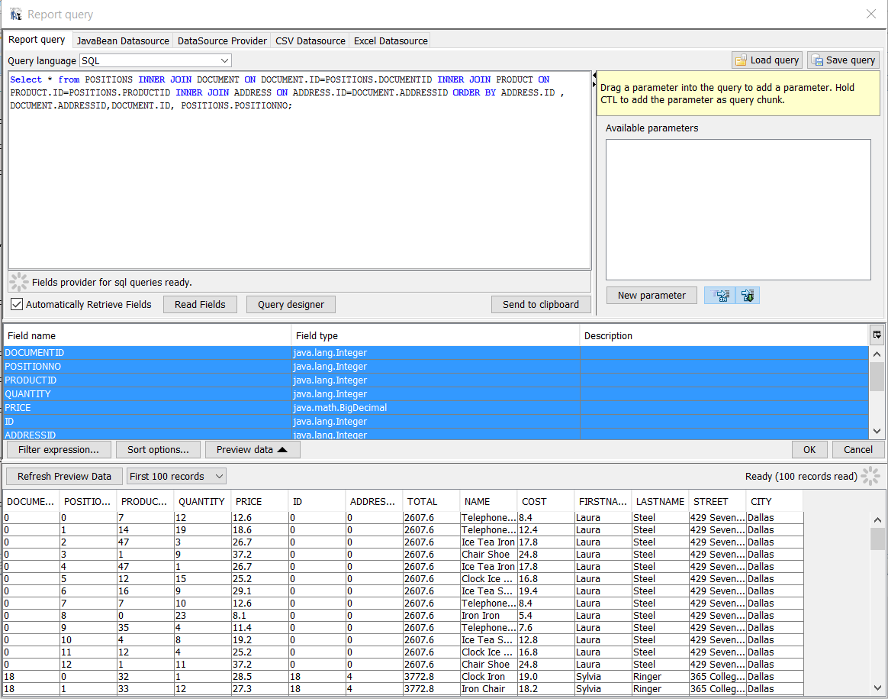|
|Fields|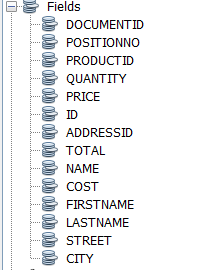|
|Variables|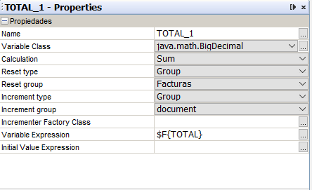|
|Agrupacion1|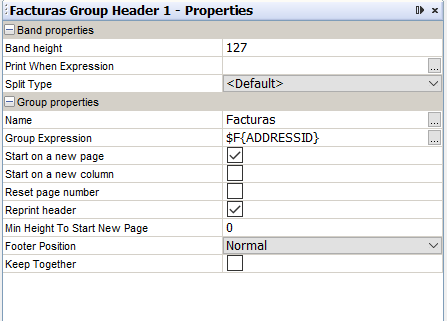|
|Agrupacion2|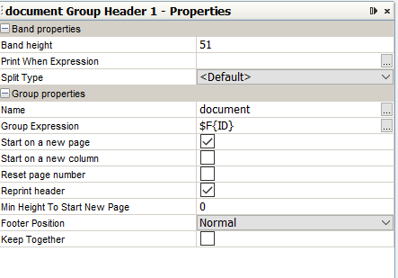|
|Designer|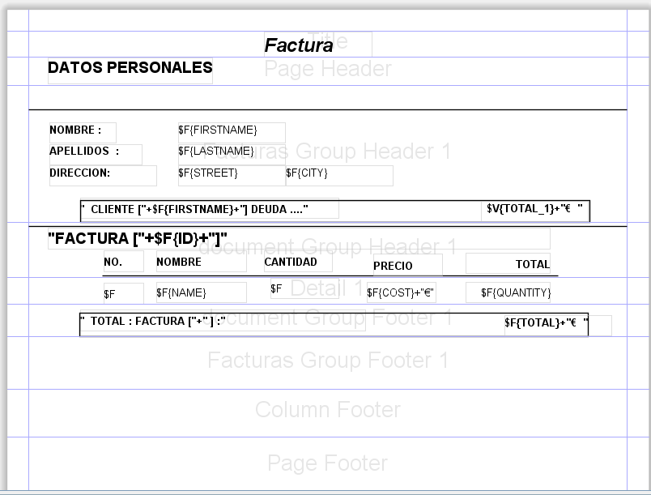|
|Inspector|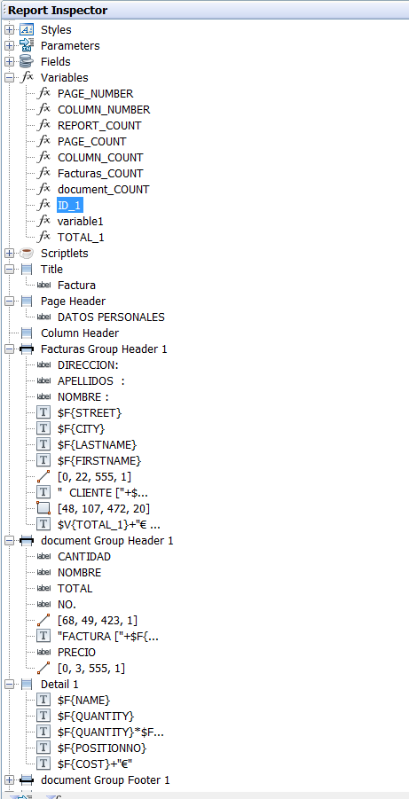|

#### Ejercicio 2
> Incluir el informe para generar facturas en un aplicación java que lo muestre en formato PDF,
> teniendo en cuenta que el código del cliente (addressid) se pasa al informe como parámetro.

| Parametro | capturas|
| ------ | ------ |
|SQL del informe|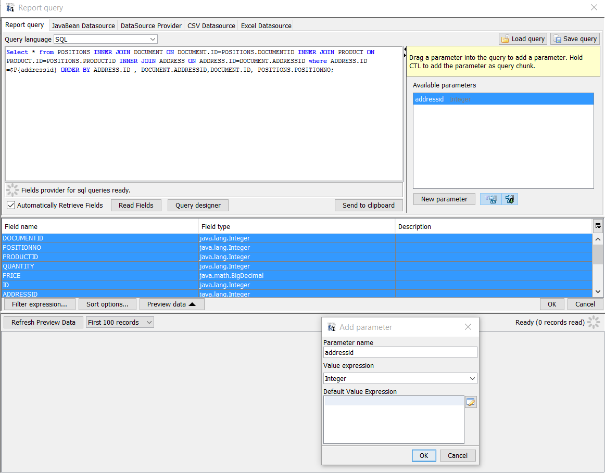|
|Panel del Informe|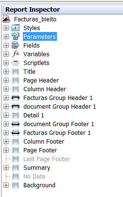|
|Parametros|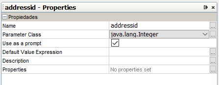|
|Fields|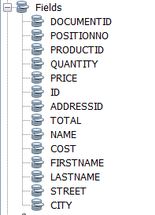|
|Variables|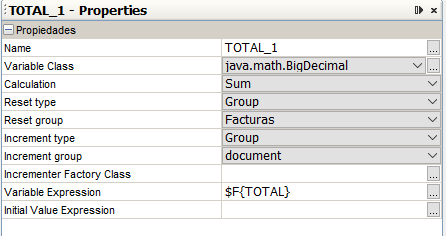|
|Agrupacion1|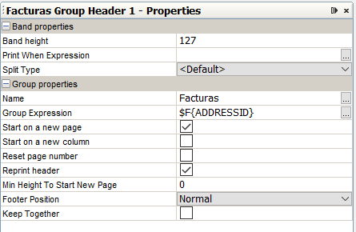|
|Agrupacion2|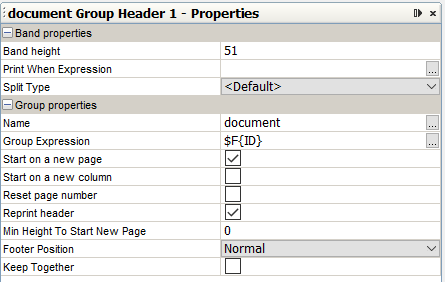|
|Designer|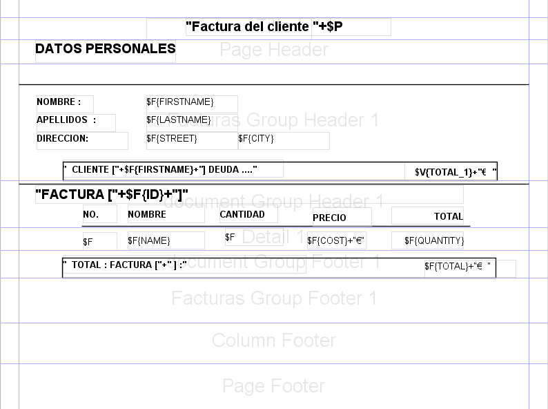|
|Inspector|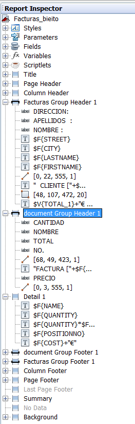|
#### Ejercicio 3
> Crear un informe en el que aparezca un listado con las ventas totales (cantidad total) de cada producto (se visualiza su nombre).
> Añadir un gráfico al informe que compare estos totales. Se debe seleccionar el tipo de gráfico que mejor se adapte al problema.

| Insrtar grafico | capturas|
| ------ | ------ |
|SQL del informe|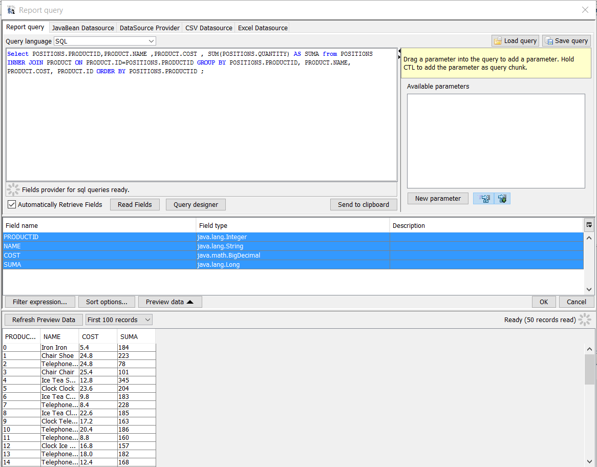|
|Variables|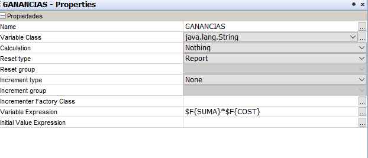|
|Designer|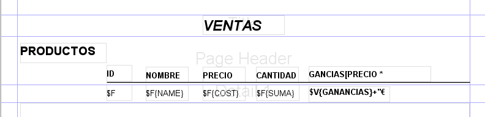|
|Inspector|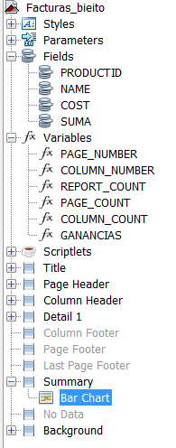|
|grafico|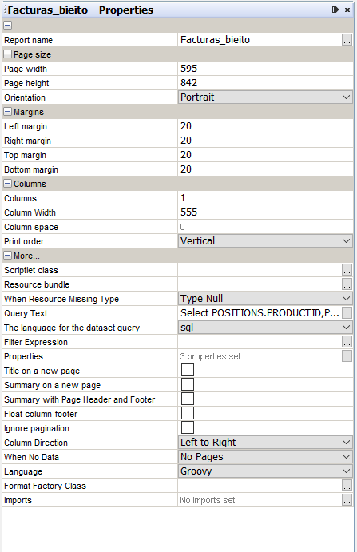|

#### Ejercicio 4
> Repite el ejercicio 1 (sin subtotales) utilizando subinformes.

| subinforme | capturas|
| ------ | ------ |
|SQL del informe|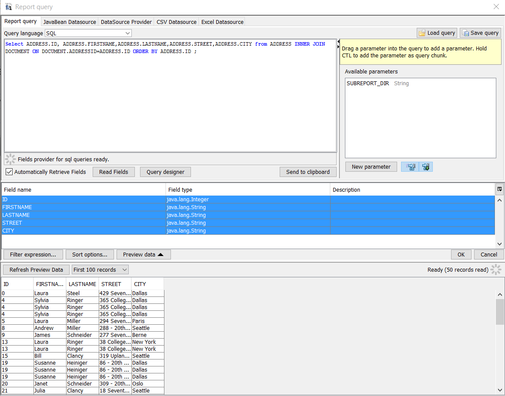|
|captura informe|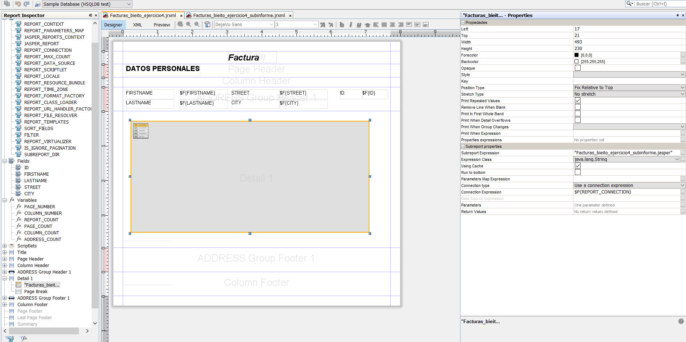|
|SQL subinforme|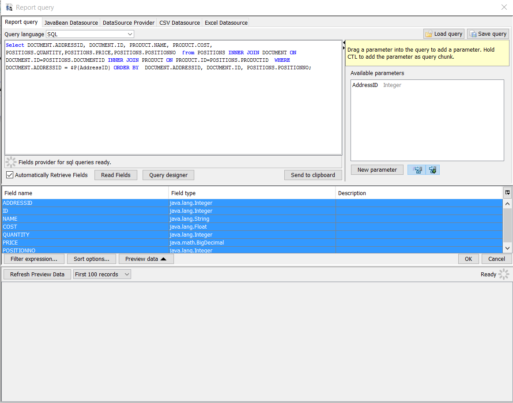|
|captura subinforme|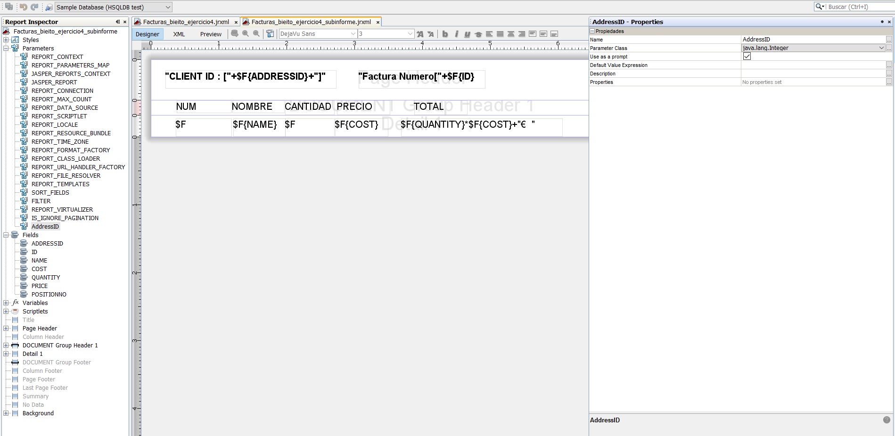|


#### conectar servidor [WINDOWS] :
```cmd
cd D:\Entregas\DI_DB\hsqldb-2.5.0\hsqldb
java -cp lib/hsqldb.jar org.hsqldb.Server -database.0 file:data/demo_db -dbname.0 xdb
```
